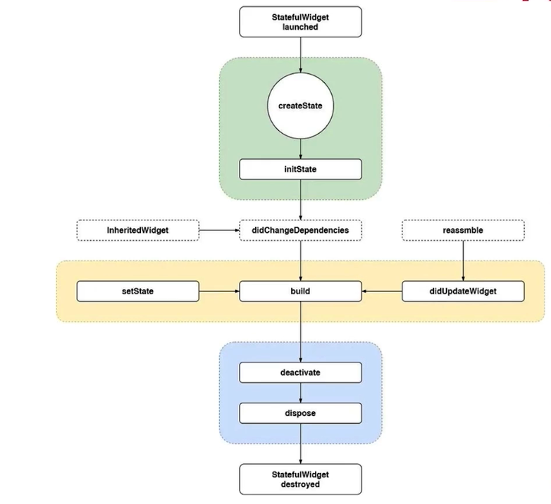

## 创建工程的方式

- 使用命令行创建 `flutter create demo_app`
- 使用 Android Studio 创建 `new flutter file`

> 工程结构

> 生命周期

- `createState`: 创建 State，当`StateFullWidget`被调用时会立即执行
- `initState`: State 初始化方法，需调用 super 重写父类方法
- `didChangeDependencies`: 该函数是在该组件依赖的 State 发生变化时调用，例如语言或主题等
- `Build`: 返回需要渲染的 Widget（重要）
- `Reassemble`: `开发阶段`使用，在`debug模式`下，每次热重载都会调用该函数
- `didUpdateWidget`: 主要是在组件重新构建时调用，比如说热重载或者父组件发生 Build
- `Deactivate`: 在组件被移除节点后会被调用，如果该组件被移除节点，然后未被插入到其他节点时，则会继续调用 dispose 永久移除
- `Dispose`: 永久移除组件，并且释放组件资源

> Flutter 工程模式

- `Flutter App`: 构建一个标准 Flutter APP（统一管理模式），包含 Dart 层和平台层（IOS/Android）
- `Flutter Module`: 创建一个 Flutter 模块（三端分离模式），以模块的形式分别嵌入原生项目
- `Flutter Package`: 纯 Dart 插件工程，不依赖 Flutter，仅包含 Dart 层的实现，通常用来定义一些公共库
- `Flutter Plugin`: Flutter 平台插件，包含 Dart 层与 Native 平台层的实现，是一种特殊的 Flutter Package
- `Flutter Skeleton`: 自动生成 Flutter 模板，提供常用框架

> 使用 flutter 命令创建工程模式的项目

`flutter create projectName`

- 用法：
  `-template=type` 指定不同的项目类型，
  `-template=app/module/package/plugin/skeleton`

- 指定平台：
  `-platforms=ios/android/windows/linux/macos/web`
  `-a` => 指定`android`开发使用的语言，默认是`kotlin`
  `-i` => 指定`ios`使用的语言，默认是`Swift`

> Flutter Native 桥接通道

- `BasicMessageChannel`: 用于传递字符串和半结构化的信息
- `EventChannel`: 用于数据流（event streams）的通信
- `MethodChannel`: 用于传递方法调用（method invocation）(主要方式)
